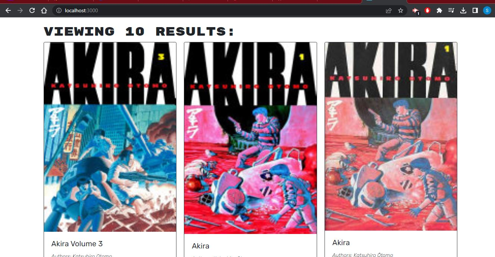

# Book Search React App

## Description

MERN stack react app that uses Apollo and GraphQL to allow users to search books by title, author, and volume

## Table of Contents

- [Installation](#installation)
- [Usage](#usage)
- [Credits](#credits)
- [License](#license)

## Installation

-bring in starter code
-npm run install
-npm run develop

## Usage

Search for Books by Volume Title and more in the search bar

## Credits

Starter Code provided by UCLA Extension Boot Camps

## License

This application is covered under the MIT license.

## Contributing

[Contributor Covenant](https://www.contributor-covenant.org/version/2/1/code_of_conduct/)
